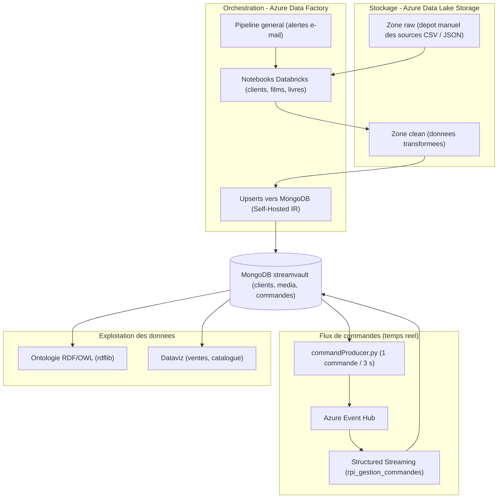

# StreamVault


## 📑 Table des matières

- [Description](#-description)
- [Fonctionnalités](#-fonctionnalités)
- [Architecture](#-architecture)
- [Prérequis](#-prérequis)
- [Configuration](#-configuration)
- [Structure du projet](#-structure-du-projet)
- [Scripts](#-scripts)
- [Auteurs](#-auteurs)
- [Licence](#-licence)

## 🎯 Description

StreamVault est un pipeline de données de bout en bout pour une plateforme fictive de distribution de médias (films et livres). Les données brutes sont chargées manuellement dans Azure Data Lake Storage, puis Azure Data Factory orchestre leur transformation par les notebooks Databricks (PySpark) et leur chargement (upsert) dans la base MongoDB locale via un runtime auto-hébergé. Un simulateur de commandes alimente ensuite Azure Event Hub en temps réel, dont le flux est consommé par Spark Structured Streaming. Le projet produit également une ontologie RDF/OWL du catalogue et des visualisations des ventes.

## ✨ Fonctionnalités

- Orchestration ADF des notebooks Databricks, upserts vers MongoDB et alertes e-mail (succès / échec)
- Self-Hosted Integration Runtime (`runtimeLocalMongo`) pour joindre le MongoDB local
- Zone ADLS `raw` alimentée manuellement, zone `clean` produite par les notebooks (nettoyage, jointures clients / code postal)
- Base MongoDB locale `streamvault` (collections `clients`, `media`, `commandes`)
- Simulateur de commandes temps réel vers Azure Event Hub (`commandProducer.py`)
- Consommation du flux par Spark Structured Streaming (ADLS + MongoDB)
- Ontologie RDF/OWL du catalogue générée avec rdflib (`output/`)
- Visualisations des ventes et du catalogue (`rendus/dataviz/`)

## 🧱 Architecture

> [!TIP]
> Le diagramme ci-dessous utilise la syntaxe Mermaid, rendue nativement sur GitHub.

Comment circulent les données des sources brutes jusqu'aux visualisations ?



## 📋 Prérequis

- Python 3.10+ et `pip`
- MongoDB local accessible sur `mongodb://localhost:27017`, base `streamvault` chargée (collections `clients`, `media`)
- Abonnement Azure : Data Factory (Integration Runtime auto-hébergé), Data Lake Storage Gen2 (conteneurs `raw` et `clean`), Event Hub, Databricks

> [!IMPORTANT]
> Le producteur exige la variable d'environnement `EVENT_HUB_CONN_STR` (chaîne de connexion de l'Event Hub, claim **Send**).

## 🔧 Configuration

| Variable | Description | Défaut |
|----------|-------------|--------|
| `EVENT_HUB_CONN_STR` (env) | Chaîne de connexion de l'Event Hub, claim **Send** requis | aucune — obligatoire |
| `MONGO_URI` | URI MongoDB (constante dans `commandProducer.py`) | `mongodb://localhost:27017/` |
| `MONGO_DB` | Base MongoDB (constante) | `streamvault` |
| `EVENT_HUB_NAME` | Nom de l'Event Hub si absent de la chaîne (constante) | `eventhubcruster` |

> [!WARNING]
> Les notebooks contiennent des placeholders (`<AZURE-KEY>`, `<EVENT-HUB-CONN-STR>`) : renseignez vos secrets dans Databricks et ne les committez jamais.

## 📁 Structure du projet

```text
.
├── notebooks/          # Notebooks Databricks (ETL, jointures, streaming)
├── output/             # Ontologie RDF générée (streamvault.ttl, streamvault.owl)
├── rendus/             # Livrables : captures ADF, schémas MongoDB, dataviz
├── commandProducer.py  # Simulateur de commandes vers Azure Event Hub
└── requirements.txt    # Dépendances Python
```

## 🧰 Scripts

| Commande | Description |
|----------|-------------|
| `pip install -r requirements.txt` | Installe les dépendances Python |
| `python commandProducer.py` | Simule 100 commandes vers l'Event Hub (une toutes les 3 s) |

## 👥 Auteurs

[TheRealRPI](https://github.com/TheRealRPI) - 🧙 Sorcier de la Data | Data Engineer en formation - Simplon.co

## 📜 Licence

Projet académique - Simplon.co
